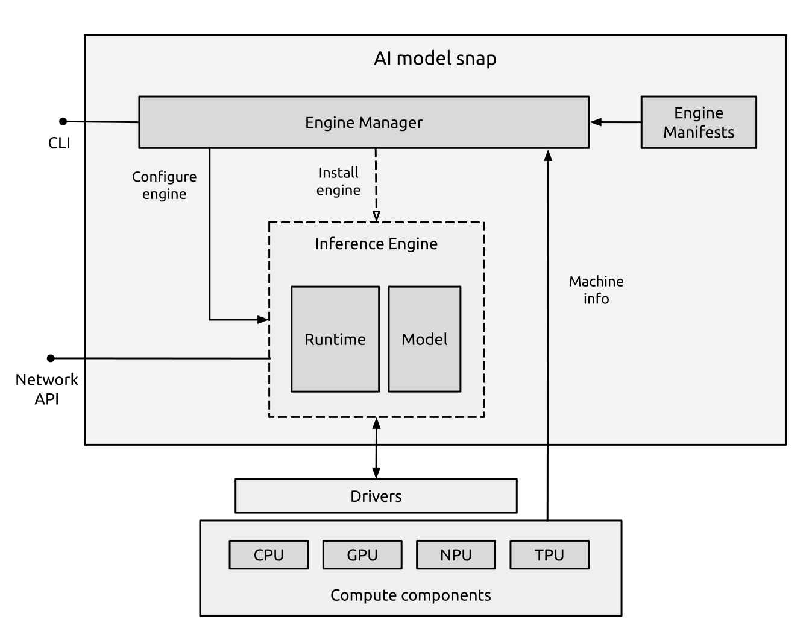

# Architecture

<!-- Another doc should explain what problem do we solve with this architecture -->

Famous Models provide easy access to silicon-optimized local inference. 
They use snaps and rely on their rich software life cycle management ecosystem to deliver the necessary components.

The primary focus of Famous Models is on Generative AI models that are pre-trained and fine-tuned.
Famous Models provide an automatic mechanism to deliver a balance of accuracy and performance tailored to the underlying silicon. 
They hide the complexity of picking model quantization and runtime optimizations from the users.

Each Famous Model snap maps to a single, fine-tuned AI model. The snap is associated with multiple [engines](../index), which are optimizations for various hardware, but installs the one that is deemed most suitable.
<!-- Another doc should explain the selection mechanism -->

In a more technical sense, each engine consists of a manifest and one or more artifacts. 
The manifest describes the requirements of the engine, such as how much memory or what GPU or NPU it needs, as well as its software components and default configurations. This information is used to select and deploy an engine on the host.

Each engine is expected to be usable in its application context, for example by providing a runtime and a networking API for user and machine interaction.

The components of the system are shown below:

Where:
* **AI model snap**: A snap package representing a specific AI model, named after the model itself.
  * **Engine Manifests**: Documents describing each inference engine’s requirements. See {ref}`engine-manifest`.
  * **Engine Manager**: The core program responsible for matching engines to hardware, installing and configuring engines, and, in some cases, providing status reporting or chat features.
  * **Inference stack**: The engine installed at runtime (only one engine can be active).
    * **Runtime**: The inference runtime that serves the model and exposes standard APIs.
    * **Model**: The model weights used for inference.
  * **CLI**: A standard command-line interface for managing the snap. See {ref}`models-cli`.
* **Drivers**: Kernel and user-space programs or libraries installed on the host to enable hardware support.
* **Compute components**: The processors and accelerators used for inference.
